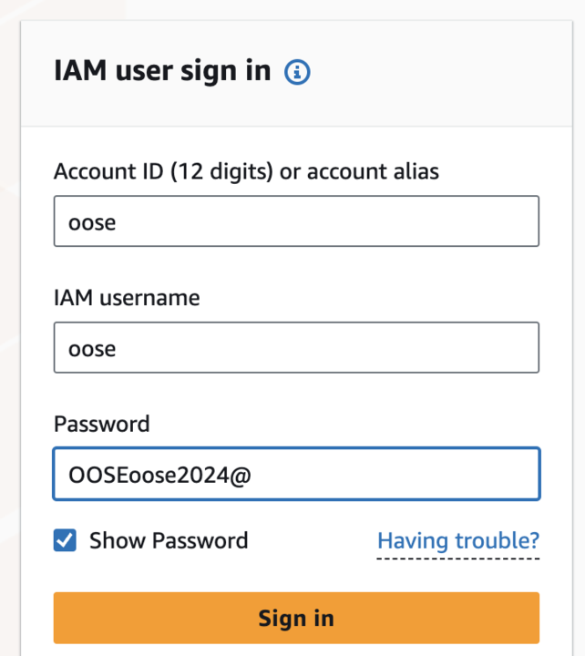
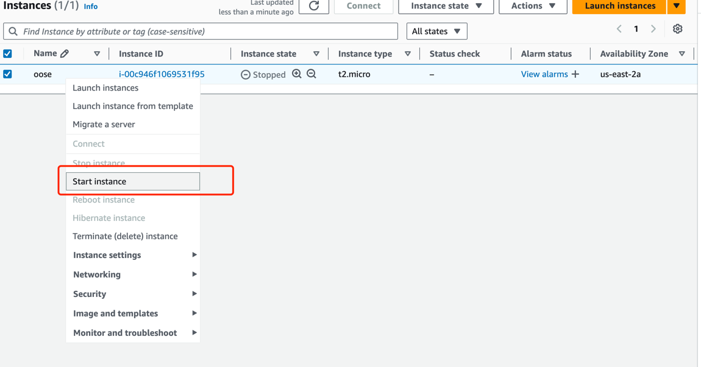

# Software Summary
This is a web application that allows Johns Hopkins students to find the perfect opportunity. Users can search based on titles, employers and more. And with our unqiue use of artificial intelligence, you can even get receive advice whenever you’re searching for opportunities. On the other hand, JobJays gives employers a user-friendly way to post opportunities and view possible candidates that would make a good fit.
# Team Members
- Ahmed Hashi
- Enoch Appiah
- Murad Azimzada
- Samuel Muzac
- Jiaxuan “Gavin” Luo
- Xinyang “Loren” Li
# Iteration 1
For this iteration, the main features we focused on were all thing related to jobs (creating, editing, searching) and being able to create users whether that be for a jobseeker or employer. All the necessary backend work for those user stories has been implemented and tested to ensure functionality. As seen in class, various front-end pages have been implemented but still need polishing, as we split up the work and want to get together once more to ensure that the entire UI follows a core theme regardless of the page. Once that is done, we will start the backend integration, which will be a task we plan on completing in iteration 2. Besides these deliverables, we also spent time setting up all the architecture we needed, such as Spring Boot, Next.js, our PostgreSQL database, and more. We made sure to communicate with each other on which specific tools we wanted to use (e.g Maven vs Gradle) before we moved any further. Moreover, we made sure to leave time for debugging and adjustments as this is a new experience for some on the team.
We also made good use of Github to facilitate project planning. We would get together and split up the different work that was left.
Our team did some more work on the UML diagrams during this iteration as well. We went through various drafts to see what’s working and what isn’t. We feel that it can still change but the one titled ‘class_diagram.mermaid’

# Iteration 2
For this iteration, we focused on integration and fleshing out some of our features. A point of feedback from Iteration 1 was the absence of integration of the frontend to the backend, so we went back and made our web application useable. We made it possible to go to each feature we started implementing from the home page and a way to return back home. 
We implemented a basic use of our search feature so that if the user searches for an employer, every employer with the letter/sequence of letters will be pulled from the database and listed for the users view. We also implemented User autenthication and the ability for a user to signup for an account on our application. The signup button transitions the user to a page where they can fill out their information to create their user profile. If the user happens to already have an account they can login into their account (by pressing Login they're transported to a page where they can input their details). The Post a job button now allows for the user (employer) to post a job for their company profile that the appicant user can view. Each job that is posted can also be edited, so the Job details can be changed. 

We implemented a notification system using Kafka for handling message queues and streams. The system is designed to notify users about relevant job matches and updates. Here's how we approached it:

Kafka Topics: We set up Kafka topics for managing different types of notifications:
applicant_preferences: This topic stores user preferences for job search criteria, such as industry, job type, and location.
new_jobs: New job postings are sent to this topic, which triggers the matching algorithm.
job_notifications: This topic handles the notifications sent to applicants based on job matches.
preference_update_requests: This topic processes requests to update user preferences.
Streams and Matching:

A Kafka Stream processes incoming job postings from the new_jobs topic and matches them against stored applicant preferences from applicant_preferences.
The matching algorithm tokenizes job descriptions and applicant preferences, scoring them based on relevance. Scoring factors include:
Industry match
Job title similarity
Salary range
Jobs with scores above a certain threshold are considered good matches and sent to the job_notifications topic.
Scoring Algorithm:
The scoring algorithm assigns weights to different factors like industry (most significant), job title, and salary preferences. A job is considered a match if it scores above 13 out of 20.
Notification Sending:

The notification_sender service subscribes to the job_notifications topic and sends out notifications (email) based on the user’s preference.
This basic setup ensures that relevant job matches are pushed to users in near real-time, but additional logging and performance improvements will be implemented in the next iteration. For future iterations, we will also optimize the scoring algorithm and improve the Kafka Streams handling to make the system more robust and scalable.  

Finally we started the implementation of our chatbot. Since the bot is still in the development process it hasn't been fully integreated but can be accessed through localhost:3000/advice. The user is able to speak to the bot where they recieve a response in real time. 
For the following iteration we plan to make sure the applicant and the employer/company users have different levels of access to prevent companies and users from accessing each others' data. 

User authentication:
When user registered an account, they will receive an mail to validate their account. Once they click the link in the email ,they can log in to the job system.
Besides, after login, we will store the login info in the session, so that users can do some thing like editing their own profile and uploading their resumes, while other applicants cannot have permission.

# Iteration 3
For this iteration, we added new features, enhanced other larger features, and fixed some errors. 

For one, we added more to our chatbot feature so that: 

- (1) users can get basic job advice with questions like "What is a resume?" and "What are some helpful tips to write a good resume?" This feature is well-suited for anyone, but especially those new to the job search process and who are looking for some basic, reliable guidance. 
- (2) users can start to leverage their own profile (such as experiences, preference) and saved jobs to receive advice from the chatbot. This involved lots of prompt engineering to find which prompts yield the best results and more research will be done in the next iteration to further advance this. A good question to ask is "Based on my profile, which of my saved jobs would be best suited for me?". In the next iteration, hopefully, once the login functionality is fleshed out, we can further make it more personalized. 

Also, in this iteration, as stated in the directions, we aimed to complete all of the "must have" features. The biggest outstanding feature we needed to start and finish was applying to jobs. We were able to add this functionality along with being able to view applicants (/view-applicants/[id]). We also implemented the feature for applicants to save jobs that they may be interested in and would like to come back to or that they would like the chatbot to easily reference. We also implemented a feature that tracks the views of a job post so that an emplouyer can see the impressions that their job posts have had.

We also got ahead on the next iteration and began to work on polishing the UI. This task will continued to be worked on for the next iteration so we can ensure we have a great looking, cohesive application. 

We also made changes to our UML diagram to mimic the state of our application at this point, which you can find in: ‘class_diagram.mermaid’ 

### How Preference, JobMatching Services works(video explanation) -  https://drive.google.com/file/d/1K8zL4N61aZ6ESc-EVxIhXuNwvQRUu8E2/view?usp=sharing
# Start the remote database in cloud

## the localhost way is to use the local database to test:
It is much faster.

step1:download the postgres server.

https://www.postgresql.org/download/

please use the username:postgres and password:postgres

Or you have to modify the application.properties to specify your username and password of database.

step2:run the local postgres server

step3:check the application.properties:

spring.datasource.url=jdbc:postgresql://localhost:5432/postgres

## the formal way is to use the remote database:
The remote way is to use AWS's permitted account to start the remote server. (do not use it for too long cause it costs money, and stop it after using)

Click this URL and enter the login information below:

https://us-east-2.console.aws.amazon.com/ec2/home?region=us-east-2#Instances:v=3;$case=tags:true%5C,client:false;$regex=tags:false%5C,client:false



And find the instance named 'oose':



You should wait until the status check column becomes '2/2 checks passed' from 'initializing'.

And after finished, the public IP address will reallocate and you have to change the application.properties to its new public IP
spring.datasource.url=jdbc:postgresql://your_new_ip:5432/postgres

After using, stop the instance on the AWS.


# Running the JobJays Backend(KAFKA Server) with Docker

Follow the instructions below to quickly set up and run the backend services for the JobJays application using Docker Compose.

## Steps to Run

1. **Navigate to the backend directory**  
   Open your terminal and change the current directory to the backend folder where `docker-compose.yml` is located.

   ```bash
   cd backend


2. **Run Docker Compose**  
   Start the services by running the following command:

   ```bash
   docker-compose up
   ```

   This command will build and start all necessary containers (Kafka, Zookeeper, microservices, etc.).

3. **Access Kafka UI**  
   Once the services are running, you can monitor Kafka using Kadeck
   You can install it at https://www.kadeck.com/get-kadeck then with connecting to localhost:9092,
   you will able to see topics, messages, clusters here.

## Stopping the Services

To stop the running containers, use:

```bash
docker-compose down
```

This will stop and remove the containers but keep the images and data intact.

```

# Running the Application

## Backend
Springboot 3.3.4
JDK 22
Java 17
Maven 3.9.8
Make sure you have these installed on your machine before running the application.
To run the backend, navigate to the `backend` directory and run the following command:

```mvn spring-boot:run```

It should be running on port 8080

#Front-End Deployment
URL_Link:https://jobjays-460j77ru6-samuel-muzacs-projects.vercel.app 

## Frontend
run the commands:
```pnpm install```
```pnpm dev```

then navigate to `http://localhost:3000` to view the application.
